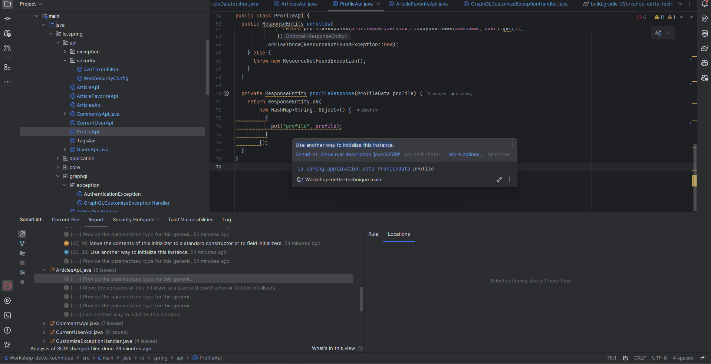

# Workshop: Libérez-vous de la dette technique grâce à l'IA et au refactoring automatisé

## Qualité du code avec GitHub Copilot

Dans cet atelier, nous allons voir comment utiliser GitHub Copilot pour améliorer la qualité du code de notre application.

Le résultat de la nouvelle analyse affiche un niveau de qualité pouvant être amélioré au niveau de la sécurité, de la fiabilité et de la maintenabilité.

Nous allons corriger les éléments majeurs relevés par le *gating* et allons résoudre d'autres enjeux intéressants présent dans le code

### Lier le plugin SonarLint à son instance SonarQube

Nous allons commencer par lier le plugin SonarLint à l'instance SonarQube pour synchroniser les règles de qualité de code ainsi que les problèmes détectés.

1. Avant de commencer, copiez quelque part en dehors d'IntelliJ votre token d'authentification SonarQube, que vous avez déjà copié dans le fichier build.gradle

2. Allez dans Settings → Tools → SonarLint et cliquez sur le bouton "+". Dans la fenêtre qui s'ouvre, entrez un nom pour la connexion (par exemple local), sélectionnez "SonarQube" et ajoutez l'URL de votre instance SonarQube (http://localhost:9000)
3. Entrez enfin votre token d'authentification et cliquez sur "Next", encore "Next" et enfin "Create"
4. Retourner dans Settings → Tools → SonarLint → Project Settings et sélectionnez la connexion que vous venez de créer
5. Cliquez sur "Search in the list" et sélectionnez le projet "workshop-dette-technique". 
6. Cliquer sur "OK".

La configuration est maintenant terminée, si jamais vous ne voyez pas des problèmes que SonarQube devrait relever dans l'IDE, redémarrez IntelliJ. 

### Score au niveau de la sécurité
#### Retirer OpenRewrite

Pour les problèmes de sécurité dans les dépendances, toutes les failles proviennent du plugin `openrewrite-gradle-plugin` qui est utilisé pour la migration.

Maintenant que nous avons fait la migration, nous pouvons retirer ce plugin du projet en utilisant l'assistant GitHub Copilot pour lui demander de supprimer toute référence à ce projet.

Pour cela, ouvrez le chat de GitHub Copilot et demandez-lui par exemple :

```
Dans le fichier build.gradle supprime toute référence à rewrite
```

La réponse retournée devrait vous avoir retiré toute référence à `openrewrite` soit les lignes suivantes ne devraient plus être là: 

- `id "org.openrewrite.rewrite" ...`
- `rewrite { activeRecipe("org.openrewrite.java.spring.boot3.UpgradeSpringBoot_3_2") }`
- `rewrite("org.openrewrite.recipe:rewrite-spring:5.8.0")`

#### Mise à jour de dépendances

Pour l'ensemble des dépendances à mettre à jour, utilisez IntelliJ pour vous aider.

Exemple : 
- `org.xerial:sqlite-jdbc`, mettre à jour en cliquant sur la CVE et en sélectionnant la version `3.41.2.2`

Il restera encore des vulnérabilités non déclarées dans le `build.gradle` à ajouter : 

```groovy
implementation 'com.fasterxml.jackson.core:jackson-databind:2.16.0'
implementation 'com.google.protobuf:protobuf-java:3.21.7'
```

À ce stade, le niveau de sécurité est désormais à `A` !

### Maintenabilité et fiabilité

Nous allons cibler maintenant des éléments que GitHub Copilot peut nous aider à améliorer.

#### Utilisation de 'instanceof'

Dans la classe `GraphQLCustomizeExceptionHandler.java`, vous devriez voir un code smell sur la ligne 42.

Pour ce code smell, il n'y a pas de correction rapide disponible, pour l'exercice nous allons utiliser Github Copilot.

Pour cela, ouvrez le chat de GitHub Copilot et demandez-lui un fix pour la description du code smell, par exemple:

```
/fix Replace this instanceof check and cast with 'instanceof ConstraintViolationException constraintviolationexception' Only generate the snippet
```

Il vous proposera alors un code de correction que vous pourrez copier-coller dans votre IDE, en validant que la solution proposée est correcte.


#### Maintenabilité dans le fichier profileApi 

Nous allons régler plusieurs problèmes de maintenabilité dans le fichier `ProfileApi.java`. 

Nous allons tout d'abord régler le problème de la méthode profileResponse à la ligne 70. Sélectionner le message d'erreur de SonarLint comme sur la capture d'écran suivante: 



Dans le chat de GitHub Copilot, copier le message de cette façon : 

```
/fix Use another way to initialize this instance.
```

Nous allons faire la même chose pour le problème sur Response Entity. Par contre, cette erreur se retrouve à plusieurs endroits dans le fichier, nous allons donc sélectionner de la ligne 28 jusqu'à la ligne 74, puis dans le chat de Github Copilot demandez lui par exemple:

```
/fix Raw use of parameterized class 'ResponseEntity' 
Provide the parametrized type for this generic.
```

De cette façon, le problème sera résolu pour toutes les occurrences de l'erreur !

<details>
    <summary>Solution du fichier profileApi.java</summary>
    
```java
    @GetMapping
    public ResponseEntity<HashMap<String, ProfileData>> getProfile(
        @PathVariable String username, @AuthenticationPrincipal User user) {
      return profileQueryService
          .findByUsername(username, user)
          .map(this::profileResponse)
          .orElseThrow(ResourceNotFoundException::new);
    }
    
    @PostMapping(path = "follow")
    public ResponseEntity<HashMap<String, ProfileData>> follow(
        @PathVariable String username, @AuthenticationPrincipal User user) {
      return userRepository
          .findByUsername(username)
          .map(
              target -> {
                FollowRelation followRelation = new FollowRelation(user.getId(), target.getId());
                userRepository.saveRelation(followRelation);
                return profileResponse(profileQueryService.findByUsername(username, user).get());
              })
          .orElseThrow(ResourceNotFoundException::new);
    }
    
    @DeleteMapping(path = "follow")
    public ResponseEntity<HashMap<String, ProfileData>> unfollow(
        @PathVariable String username, @AuthenticationPrincipal User user) {
      Optional<User> userOptional = userRepository.findByUsername(username);
      if (userOptional.isPresent()) {
        User target = userOptional.get();
        return userRepository
            .findRelation(user.getId(), target.getId())
            .map(
                relation -> {
                  userRepository.removeRelation(relation);
                  return profileResponse(profileQueryService.findByUsername(username, user).get());
                })
            .orElseThrow(ResourceNotFoundException::new);
      } else {
        throw new ResourceNotFoundException();
      }
    }
    
    private ResponseEntity<HashMap<String, ProfileData>> profileResponse(ProfileData profile) {
      HashMap<String, ProfileData> map = new HashMap<>();
      map.put("profile", profile);
    
      return ResponseEntity.ok(map);
    }
```
</details>

> [!WARNING]
Il est important de toujours contre-vérifier les modifications proposées par GitHub Copilot pour s'assurer qu'elles sont correctes. Particulièrement pour des changements sur plusieurs méthodes.

## Félicitation !

Les problèmes qui empêchaient le *gating* de passer sont maintenant corrigés. Si vous êtes limités par le temps, exécuter pour admirer votre travail:

```bash
./gradlew test dependencyCheckAnalyze sonar 
```

Sinon, on peut passer à l'étape suivante, où nous allons faire des exercices pour améliorer encore plus la qualité du code: [Mise en place de la méthode "Clean as you code"](COMPLEXITY.md)

