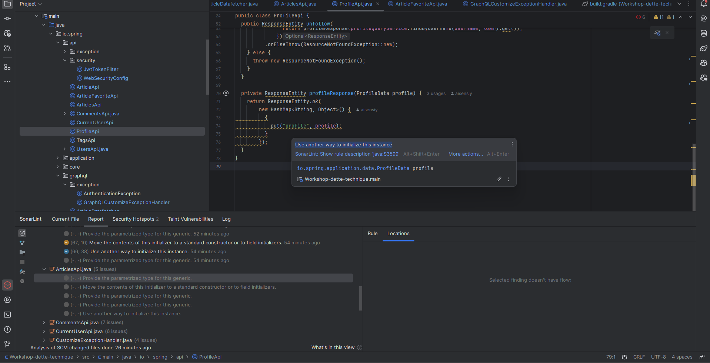

# Workshop: Libérez-vous de la dette technique grâce à l'IA et au refactoring automatisé

## Mise en contexte

Dans cette section, nous allons corriger plusieurs cas relevé par sonarlint qui sont intéressant afin d'explorer plus en profondeur GitHub Copilot.


## Résoudre un cas de complexité cognitive
Un cas de complexité cognitive apparaît lorsqu'une méthode ou une classe est trop complexe à comprendre. Cela peut être dû à une longue liste de paramètres, une longue liste d'instructions, des conditions imbriquées, etc.
À terme cela peut rendre le code difficile à maintenir et à faire évoluer.

Pour les besoins du workshop, nous avons modifier une méthode pour la rendre volontaire trop complexe et faire en sorte que SonarQube le relève.
Cette méthode est `findUserFeed` dans la classe `ArticleQueryService`.

### Générer de la documentation

Une bonne chose à faire pour commencer à résoudre le problème est de comprendre ce que fait la méthode. Si malheureusement il n'y a pas de documentation, nous pouvons utiliser Github Copilot pour nous aider à en générer.
Pour cela, sélectionnez l'ensemble de la méthode `findUserFeed`, faites un clic droit sur la sélection et choisissez "Generate Docs" dans le menu "GitHub Copilot".
Le chat devrait vous répondre le bloc de code que vous avez sélectionné, précédé d'un bloc de documentation au format Javadoc.
Prenez le temps de lire la documentation générée et de la comparer avec ce que fait réellement la méthode.

### Simplifier la méthode

Maintenant que nous avons une documentation, nous pouvons commencer à simplifier la méthode.
Le moyen le plus simple de diminuer la complexité cognitive d'une méthode est de la diviser en plusieurs méthodes plus petites, chacune ayant une responsabilité unique.
Pour cela, nous allons utiliser Github Copilot pour nous aider à extraire des méthodes.\
Sélectionnez la méthode `findUserFeed`, ouvrez le chat Copilot et demandez-lui par exemple:
```
Réduit la complexité de la méthode findUserFeed en la séparant en plusieurs méthodes.
```

## Maintenabilité dans le fichier profileApi 

Nous allons régler plusieurs problèmes de maintenabilité dans le fichier `ProfileApi.java`. 

Nous allons tout d'abord régler le problème de la méthode profileResponse à la ligne 70. Sélectionner le message d'erreur de SonarLint comme sur la capture d'écran suivante: 



Dans le chat de Github Copilot demandez lui par exemple:

```
/fix Use another way to initialize this instance.
```

Nous allons faire la même chose pour le problème sur Response Entity. Parcontre, cette erreur se retrouve à plusieurs endroits dans le fichier, nous allons donc sélectionner de la ligne 28 jusqu'à la ligne 74, puis dans le chat de Github Copilot demandez lui par exemple:

```
/fix Raw use of parameterized class 'ResponseEntity' 
Provide the parametrized type for this generic.
```

<details>
    <summary>Solution</summary>
    
```java
    @GetMapping
    public ResponseEntity<HashMap<String, ProfileData>> getProfile(
        @PathVariable String username, @AuthenticationPrincipal User user) {
      return profileQueryService
          .findByUsername(username, user)
          .map(this::profileResponse)
          .orElseThrow(ResourceNotFoundException::new);
    }
    
    @PostMapping(path = "follow")
    public ResponseEntity<HashMap<String, ProfileData>> follow(
        @PathVariable String username, @AuthenticationPrincipal User user) {
      return userRepository
          .findByUsername(username)
          .map(
              target -> {
                FollowRelation followRelation = new FollowRelation(user.getId(), target.getId());
                userRepository.saveRelation(followRelation);
                return profileResponse(profileQueryService.findByUsername(username, user).get());
              })
          .orElseThrow(ResourceNotFoundException::new);
    }
    
    @DeleteMapping(path = "follow")
    public ResponseEntity<HashMap<String, ProfileData>> unfollow(
        @PathVariable String username, @AuthenticationPrincipal User user) {
      Optional<User> userOptional = userRepository.findByUsername(username);
      if (userOptional.isPresent()) {
        User target = userOptional.get();
        return userRepository
            .findRelation(user.getId(), target.getId())
            .map(
                relation -> {
                  userRepository.removeRelation(relation);
                  return profileResponse(profileQueryService.findByUsername(username, user).get());
                })
            .orElseThrow(ResourceNotFoundException::new);
      } else {
        throw new ResourceNotFoundException();
      }
    }
    
    private ResponseEntity<HashMap<String, ProfileData>> profileResponse(ProfileData profile) {
      HashMap<String, ProfileData> map = new HashMap<>();
      map.put("profile", profile);
    
      return ResponseEntity.ok(map);
    }
```
</details>

> [!WARNING]
Il est important de toujours contre-vérifier les modifications proposées par Github Copilot pour s'assurer qu'elles sont correctes. Particulièrement pour des changements sur plusieurs méthodes.


## Utilisation des références de méthode dans les lambdas

Si vous allez dans la classe `ArticleFavoriteApi.java`, plusieurs enjeux de maintenabilité sont présent. Sélectionner le message d'erreur de SonarLint comme sur la capture d'écran suivante: 


Dans le chat de Github Copilot demandez lui par exemple:

```
/fix Call "Optional#isPresent()" or "!Optional#isEmpty()" before accessing the value.
```

Vous devriez avoir un résultat qui ressemble à ceci:

```java
  @PostMapping
  public ResponseEntity favoriteArticle(
      @PathVariable String slug, @AuthenticationPrincipal User user) {
    Article article =
        articleRepository.findBySlug(slug).orElseThrow(ResourceNotFoundException::new);
    ArticleFavorite articleFavorite = new ArticleFavorite(article.getId(), user.getId());
    articleFavoriteRepository.save(articleFavorite);
      Optional<ArticleData> optionalArticleData = articleQueryService.findBySlug(slug, user);
      if (optionalArticleData.isEmpty()) {
          throw new ResourceNotFoundException();
      }
      return responseArticleData(optionalArticleData.get());
  }
```

Vous pouvez par la suite sélectionner la méthode unfavoriteArticle, puis dans le chat peser sur la flèche du haut pour réutiliser le dernier message

le résultat devrait ressembler à ceci:

```java
    @DeleteMapping
    public ResponseEntity unfavoriteArticle(
        @PathVariable String slug, @AuthenticationPrincipal User user) {
      Article article =
          articleRepository.findBySlug(slug).orElseThrow(ResourceNotFoundException::new);
      articleFavoriteRepository
          .find(article.getId(), user.getId())
          .ifPresent(
              favorite -> {
                articleFavoriteRepository.remove(favorite);
              });
      Optional<ArticleData> optionalArticleData = articleQueryService.findBySlug(slug, user);
      if (optionalArticleData.isEmpty()) {
          throw new ResourceNotFoundException();
      }
      return responseArticleData(optionalArticleData.get());
    }
```

## Mauvais initialisation de HashMap avec duplication

Dans le fichier ArticleDataFetcher.java, nous allons corriger les trois mauvaises initialisations de HashMap qui sont dupliquées.
Pour ce faire sélectionner la ligne 300 à 357, puis dans le chat de Github Copilot demandez lui par exemple:

```
move initialization of hashmap in method
```

Il devrait vous proposer une nouvelle méthode ainsi que les modifications aux trois méthodes existantes.

[!TIP]
Lorsque Copilot vous propose des changements, mais qu'il n'inclut pas complètement le code( Il met un commentaire `//...` par exemple), vous pouvez peser sur la flèche du haut dans le chat pour que votre dernier message soit réutilisé, puis ajouter dans votre message generate all the code

## Félicitation !

Vous avez maintenant un application beaucoup plus robuste et votre équipe à compris comment utiliser adéquatement Github Copilot pour améliorer la qualité du code. Si vous avez du temps, vous pouvez exécuter pour admirer votre travail:

```bash
./gradlew test dependencyCheckAnalyze sonar 
```