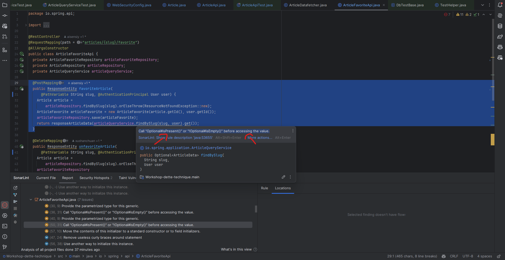
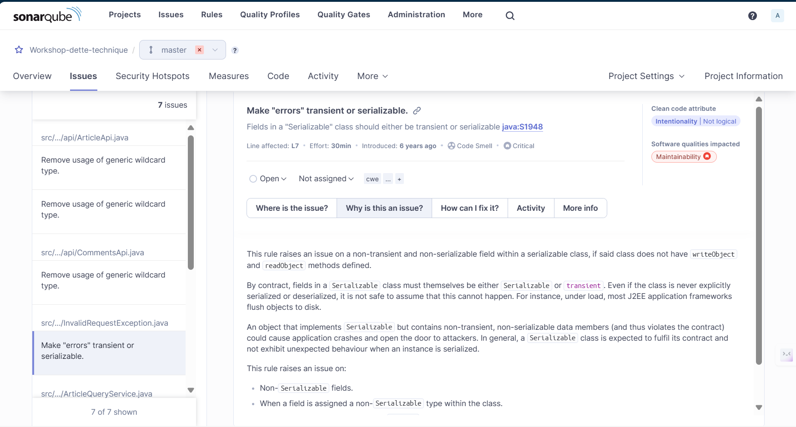

# Workshop: Libérez-vous de la dette technique grâce à l'IA et au refactoring automatisé

## Mise en contexte

Dans cette section, nous allons corriger plusieurs cas relevé par sonarlint qui sont intéressant afin d'explorer plus en profondeur GitHub Copilot.


## Résoudre un cas de complexité cognitive
Un cas de complexité cognitive apparaît lorsqu'une méthode ou une classe est trop complexe à comprendre. Cela peut être dû à une longue liste de paramètres, une longue liste d'instructions, des conditions imbriquées, etc.
À terme cela peut rendre le code difficile à maintenir et à faire évoluer.

Pour les besoins du workshop, nous avons modifié une méthode pour la rendre volontairement trop complexe et faire en sorte que SonarQube relève une amélioration.
Cette méthode est `findUserFeed` dans la classe `ArticleQueryService`.

### Générer de la documentation

Une bonne chose à faire pour commencer à résoudre le problème est de comprendre ce que fait la méthode. Si malheureusement il n'y a pas de documentation, nous pouvons utiliser Github Copilot pour nous aider à en générer.
Pour cela, sélectionnez l'ensemble de la méthode `findUserFeed`, faites un clic-droit sur la sélection et choisissez "Generate Docs" dans le menu "GitHub Copilot".
Le chat devrait vous répondre le bloc de code que vous avez sélectionné, précédé d'un bloc de documentation au format Javadoc.
Prenez le temps de lire la documentation générée et de la comparer avec ce que fait réellement la méthode.

### Réduire la complexité

Pour réduire la complexité de la méthode `findUserFeed`, nous allons demander à GitHub Copilot de la découper en plusieurs méthodes, chacune ayant une responsabilité unique.
Pour cela, sélectionnez l'ensemble de la méthode `findUserFeed`, ouvrez le chat et demandez lui quelque chose comme:

```
/fix reduce cognitive complexity of this method
```

Vous devriez obtenir une réponse qui ressemble à ceci:

```java
public ArticleDataList findUserFeed(User user, Page page) {
    List<String> followedUsers = userRelationshipQueryService.followedUsers(user.getId());
    if (followedUsers.isEmpty()) {
      return new ArticleDataList(new ArrayList<>(), 0);
    } else {
      List<ArticleData> articles = articleReadService.findArticlesOfAuthors(followedUsers, page);
      setFavoriteCounts(articles);
    if (user != null) {
      setIsFavorite(articles, user);
      setFollowingAuthors(articles, user);
    }
    int count = articleReadService.countFeedSize(followedUsers);
    return new ArticleDataList(articles, count);
}


private void setFavoriteCounts(List<ArticleData> articles) {
    List<String> articleIds = articles.stream().map(ArticleData::getId).collect(Collectors.toList());
    List<ArticleFavoriteCount> favoritesCounts = articleFavoritesReadService.articlesFavoriteCount(articleIds);
    Map<String, Integer> countMap = favoritesCounts.stream().collect(Collectors.toMap(ArticleFavoriteCount::getId, ArticleFavoriteCount::getCount));
    articles.forEach(articleData -> articleData.setFavoritesCount(countMap.get(articleData.getId())));
}

private void setFollowingAuthors(List<ArticleData> articles, User user) {
    List<String> profileDataIds = articles.stream().filter(articleData -> articleData.getProfileData() != null).map(articleData -> articleData.getProfileData().getId()).collect(Collectors.toList());
    Set<String> followingAuthors = userRelationshipQueryService.followingAuthors(user.getId(), profileDataIds);
    articles.forEach(articleData -> {
        if (followingAuthors.contains(articleData.getProfileData().getId())) {
          articleData.getProfileData().setFollowing(true);
        }
    });
}
```

Dans le cadre de l'exercice, c'est nous en préparant le workshop qui avons rendu la méthode complexe, en copiant le contenu des méthodes qui étaient appelées par `findUserFeed` directement dans la méthode.\
On peut donc se placer dans un cas ou les méthodes que l'on veut appeler pour réduire la complexité existent déjà. Copilot devrait être capable de les trouver et de les appeler à la place, si on lui mentionne que les méthodes existent déjà.
On peut donc modifier notre prompt pour utiliser quelque chose de la sorte:

```
/fix reduce cognitive complexity of this method using existing methods in the class
```

Voici le résultat que vous devriez obtenir:

```java
public ArticleDataList findUserFeed(User user, Page page) {
    List<String> followedUsers = userRelationshipQueryService.followedUsers(user.getId());
    if (followedUsers.isEmpty()) {
      return new ArticleDataList(new ArrayList<>(), 0);
    } else {
      List<ArticleData> articles = articleReadService.findArticlesOfAuthors(followedUsers, page);
      setFavoriteCount(articles);
    if (user != null) {
      setIsFavorite(articles, user);
      setIsFollowingAuthor(articles, user);
    }
    int count = articleReadService.countFeedSize(followedUsers);
    return new ArticleDataList(articles, count);
}
```

### Valider la solution

Maintenant que nous avons refactoré la méthode et que ça comlexité est réduite, il nous reste simplement à valider que nous n'avons pas modifier la logique.
Pour cela vous pouvez exécuter les tests unitaires de la classe `ArticleQueryServiceTest` pour valider que la méthode `findUserFeed` fonctionne toujours correctement.

## Résoudre les problèmes dans ArticleFavoriteApi

Si vous allez dans la classe `ArticleFavoriteApi.java`, plusieurs enjeux de maintenabilité sont présent. Sélectionner le message d'erreur de SonarLint comme sur la capture d'écran suivante: 



Dans le chat de GitHub Copilot, demandez-lui par exemple :

```
/fix Call "Optional#isPresent()" or "!Optional#isEmpty()" before accessing the value.
```

Vous devriez avoir un résultat qui ressemble à ceci :

```java
  @PostMapping
  public ResponseEntity favoriteArticle(
      @PathVariable String slug, @AuthenticationPrincipal User user) {
    Article article =
        articleRepository.findBySlug(slug).orElseThrow(ResourceNotFoundException::new);
    ArticleFavorite articleFavorite = new ArticleFavorite(article.getId(), user.getId());
    articleFavoriteRepository.save(articleFavorite);
      Optional<ArticleData> optionalArticleData = articleQueryService.findBySlug(slug, user);
      if (optionalArticleData.isEmpty()) {
          throw new ResourceNotFoundException();
      }
      return responseArticleData(optionalArticleData.get());
  }
```

Vous pouvez par la suite sélectionner la méthode unfavoriteArticle, puis dans le chat, appuyer sur la flèche du haut pour réutiliser le dernier message.

Le résultat devrait ressembler à ceci :

```java
    @DeleteMapping
    public ResponseEntity unfavoriteArticle(
        @PathVariable String slug, @AuthenticationPrincipal User user) {
      Article article =
          articleRepository.findBySlug(slug).orElseThrow(ResourceNotFoundException::new);
      articleFavoriteRepository
          .find(article.getId(), user.getId())
          .ifPresent(
              favorite -> {
                articleFavoriteRepository.remove(favorite);
              });
      Optional<ArticleData> optionalArticleData = articleQueryService.findBySlug(slug, user);
      if (optionalArticleData.isEmpty()) {
          throw new ResourceNotFoundException();
      }
      return responseArticleData(optionalArticleData.get());
    }
```

## Mauvaise initialisation de HashMap avec duplication

Dans le fichier ArticleDataFetcher.java, nous allons corriger les trois mauvaises initialisations de HashMap qui sont dupliquées.
Pour se faire, sélectionnez la ligne 300 à 357, puis dans le chat de Github Copilot demandez lui par exemple:

```
move initialization of hashmap in method
```

Il devrait vous proposer une nouvelle méthode ainsi que les modifications aux trois méthodes existantes.

> [!TIP]
Lorsque Copilot vous propose des changements, mais qu'il n'inclut pas complètement le code( Il met un commentaire `//...` par exemple), vous pouvez peser sur la flèche du haut dans le chat pour que votre dernier message soit réutilisé, puis ajouter dans votre message `generate all the code`

## Une erreur de sérialisation un peu ambiguë
Nous allons explorer une erreur de sérialisation dans le fichier `InvalidRequestException.java`. Copier le message de SonarLint sur le champ `errors` et demandez à Copilot de le corriger. Vous devriez avoir quelque chose comme ceci:

```
/fix Make 'errors' transient or serializable.
```

Le résultat devrait ressembler à ceci :

```java
  private final transient Errors errors;
```

Afin de s'assurer que la solution fournie convient à notre problème, il est recommandé ici de se rendre dans sonarqube afin de trouver le problème. SonarQube fournit des informations importantes afin de bien diagnostiquer si la solution correspond au besoin



Ici, nous avons un exemple où les deux outils peuvent travailler ensemble pour résoudre un problème qui n'a pas une solution directe.

## Félicitation !

Vous avez maintenant une application beaucoup plus robuste et votre équipe a compris comment utiliser adéquatement Github Copilot pour améliorer la qualité du code. Si vous avez du temps, vous pouvez exécuter pour admirer votre travail:

```bash
mvn install sonar:sonar
```
