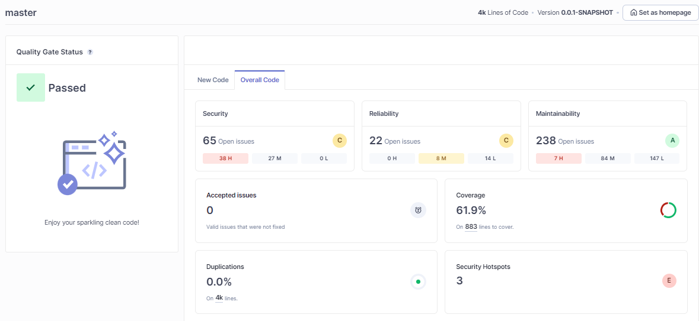

# Workshop: Libérez-vous de la dette technique grâce à l'IA et au refactoring automatisé

## Fixer la migration avec GitHub Copilot

Dans cette partie de l'atelier, vous allez corriger les erreurs de migration en utilisant les capacités de l'assistant AI Github Copilot directement dans l'IDE  IntelliJ.

Certaines corrections seront plus complexes que d'autres étant donné que les données de GitHub Copilot n'inclut pas encore les données des versions de SpringBoot 3.x.

### io.spring.api.exception.CustomizeExceptionHandler

Localisez la classe `CustomizeExceptionHandler` et déplacez-vous à la ligne 62.

Dans ce fichier les recettes de migration OpenRewrite n'ont pas mise à jour l'objet `HttpStatus` par `HttpStatusCode` (une mise à jour est en cours de discussion sur les forums: https://github.com/openrewrite/rewrite-spring/issues/369).

Vous pouvez donc remplacer la signature de la méthode par celle-ci: 

```java
  @Override
  protected ResponseEntity<Object> handleMethodArgumentNotValid(
      MethodArgumentNotValidException e,
      HttpHeaders headers,
      HttpStatusCode status,
      WebRequest request) {
```

Important: N'oubliez pas d'importer `import org.springframework.http.HttpStatusCode;`

### io.spring.api.security.WebSecurityConfig#filterChain

Localisez la classe `WebSecurityConfig` et déplacez-vous à la ligne 37.

Dans la méthode `SecurityFilterChain filterChain(HttpSecurity http)`, l'erreur de compilation indique `Cannot resolve method 'cors' in 'CsrfConfigurer'`, dans ce cas d'erreur, vous pouvez sélectionner la méthode au complet et avec le bouton droit, sélectionnez dans le menu contextuel `GitHub Copilot->Fix This`.
La fenêtre de discussion avec Copilot va vous proposer une solution pour corriger cette erreur. 

L'assistant devrait vous proposer une solution pour inverser les appels à Cors par rapport à Csrf soit la réponse ci-dessous: 

> Problem 1: Misplaced method calls in the CSRF configuration. The methods cors, authenticationEntryPoint, sessionCreationPolicy, and requestMatchers are being called in the wrong context. They should be called directly on the http object, not within the csrf configuration.

**Attention: la solution proposée se base encore sur SpringBoot 2.x comme `requests.antMatchers` alors il faut seulement prendre le début de la proposition se basant vraiment sur le remplacement de `http.cors` et ajuster les parenthèses à la fin.**

Vous pouvez suivre sa proposition ou directement remplacez la méthode par ce contenu: 

```java
  @Bean
  SecurityFilterChain filterChain(HttpSecurity http) throws Exception {
    http.cors(withDefaults())
            .csrf(csrf -> csrf.disable())
            .exceptionHandling(handling -> handling
                    .authenticationEntryPoint(new HttpStatusEntryPoint(HttpStatus.UNAUTHORIZED)))
            .sessionManagement(management -> management
                    .sessionCreationPolicy(SessionCreationPolicy.STATELESS))
        .authorizeHttpRequests(requests -> requests
            .requestMatchers(HttpMethod.OPTIONS).permitAll()
            .requestMatchers("/graphiql").permitAll()
            .requestMatchers("/graphql").permitAll()
            .requestMatchers(HttpMethod.GET, "/articles/feed").authenticated()
            .requestMatchers(HttpMethod.POST, "/users", "/users/login").permitAll()
            .requestMatchers(HttpMethod.GET, "/articles/**", "/profiles/**", "/tags").permitAll()
            .anyRequest().authenticated());

    http.addFilterBefore(jwtTokenFilter(), UsernamePasswordAuthenticationFilter.class);
    return http.build();
  }
```

### io.spring.graphql.exception.GraphQLCustomizeExceptionHandler

Localisez la classe `GraphQLCustomizeExceptionHandler` et déplacez vous à la ligne 30.

La méthode `onException` ne surcharge plus la méthode de `DataFetcherExceptionHandler`, alors vous allez combiner IntelliJ avec GitHub Copilot pour régler cette erreur.

Pressez Ctrl+I et sélectionner la nouvelle version de la méthode à surcharger: `handleException`.

Remplacez le contenu de l'ancienne méthode dans la nouvelle version, vous devriez avoir une méthode avec ce contenu: 

```java
@Override
  public CompletableFuture<DataFetcherExceptionHandlerResult> handleException(DataFetcherExceptionHandlerParameters handlerParameters) {
    if (handlerParameters.getException() instanceof InvalidAuthenticationException) {
      GraphQLError graphqlError =
              TypedGraphQLError.newBuilder()
                      .errorType(ErrorType.UNAUTHENTICATED)
                      .message(handlerParameters.getException().getMessage())
                      .path(handlerParameters.getPath())
                      .build();
      return DataFetcherExceptionHandlerResult.newResult().error(graphqlError).build();
    } else if (handlerParameters.getException() instanceof ConstraintViolationException) {
      List<FieldErrorResource> errors = new ArrayList<>();
      for (ConstraintViolation<?> violation :
              ((ConstraintViolationException) handlerParameters.getException())
                      .getConstraintViolations()) {
        FieldErrorResource fieldErrorResource =
                new FieldErrorResource(
                        violation.getRootBeanClass().getName(),
                        getParam(violation.getPropertyPath().toString()),
                        violation
                                .getConstraintDescriptor()
                                .getAnnotation()
                                .annotationType()
                                .getSimpleName(),
                        violation.getMessage());
        errors.add(fieldErrorResource);
      }
      GraphQLError graphqlError =
              TypedGraphQLError.newBadRequestBuilder()
                      .message(handlerParameters.getException().getMessage())
                      .path(handlerParameters.getPath())
                      .extensions(errorsToMap(errors))
                      .build();
      return DataFetcherExceptionHandlerResult.newResult().error(graphqlError).build();
    } else {
      return defaultHandler.onException(handlerParameters);
    }
  }
```

Le code ne compile toujours pas car la signature de la méthode a changé, utilisez l'assistant GitHub Copilot pour vous proposer une solution en sélectionnant la méthode et en choisissant dans le menu contextuel `GitHub Copilot->Fix this`. 

L'assistant devrait vous proposer une solution pour ajuster les retours de fonction soit la réponse ci-dessous: 

> Problem 1: Incorrect return type in handleException method. The handleException method in the GraphQLCustomizeExceptionHandler class is expected to return a CompletableFuture<DataFetcherExceptionHandlerResult>, but currently it's returning DataFetcherExceptionHandlerResult.

Vous pouvez suivre sa proposition ou directement remplacez la méthode par ce contenu: 

```java 
@Override
  public CompletableFuture<DataFetcherExceptionHandlerResult> handleException(DataFetcherExceptionHandlerParameters handlerParameters) {
    if (handlerParameters.getException() instanceof InvalidAuthenticationException) {
      GraphQLError graphqlError =
              TypedGraphQLError.newBuilder()
                      .errorType(ErrorType.UNAUTHENTICATED)
                      .message(handlerParameters.getException().getMessage())
                      .path(handlerParameters.getPath())
                      .build();
      return CompletableFuture.completedFuture(DataFetcherExceptionHandlerResult.newResult().error(graphqlError).build());
    } else if (handlerParameters.getException() instanceof ConstraintViolationException) {
      List<FieldErrorResource> errors = new ArrayList<>();
      for (ConstraintViolation<?> violation :
              ((ConstraintViolationException) handlerParameters.getException())
                      .getConstraintViolations()) {
        FieldErrorResource fieldErrorResource =
                new FieldErrorResource(
                        violation.getRootBeanClass().getName(),
                        getParam(violation.getPropertyPath().toString()),
                        violation
                                .getConstraintDescriptor()
                                .getAnnotation()
                                .annotationType()
                                .getSimpleName(),
                        violation.getMessage());
        errors.add(fieldErrorResource);
      }
      GraphQLError graphqlError =
              TypedGraphQLError.newBadRequestBuilder()
                      .message(handlerParameters.getException().getMessage())
                      .path(handlerParameters.getPath())
                      .extensions(errorsToMap(errors))
                      .build();
      return CompletableFuture.completedFuture(DataFetcherExceptionHandlerResult.newResult().error(graphqlError).build());
    } else {
      return CompletableFuture.completedFuture(defaultHandler.onException(handlerParameters));
    }
  }
```

**Attention: n'oubliez pas de supprimer l'ancienne méthode `public DataFetcherExceptionHandlerResult onException` !**

### Correction des tests

À cette étape, si vous lancez un build, vous devriez avoir des erreurs lors de l'exécution des tests. 

Malheureusement, GitHub Copilot ne peut pas encore mettre à jour les dernières versions automatiquement, cela reste une opération manuelle.

[!TIP]
GitHub Copilot à l'heure actuelle est entrainé sur des données jusqu'en 2021. Il est limité pour les mise à jour de versions récentes.

À la ligne 56 remplacer la version de MyBatis par: 

```groovy
    implementation 'org.mybatis.spring.boot:mybatis-spring-boot-starter:3.0.3'
```
vous pouvez remplaçer le bloc de code 69 à 76 avec la version de rest assured 5.4.0:

```groovy
    testImplementation 'io.rest-assured:rest-assured:5.4.0'
    testImplementation 'io.rest-assured:json-path:5.4.0'
    testImplementation 'io.rest-assured:xml-path:5.4.0'
    testImplementation 'io.rest-assured:spring-mock-mvc:5.4.0'
```

Finalement à la ligne 76 remplacer la version de MyBatis Test par: 

```groovy
    testImplementation 'org.mybatis.spring.boot:mybatis-spring-boot-starter-test:3.0.3'
```

Ensuite compilez le projet avec la commande suivante:

```
./gradlew clean build
```

Avec tous ces changements vous devriez pouvoir build le projet sans erreurs !

### Analyse Sonar post-migration

Lancez une nouvelle analyse Sonar après la migration pour voir la qualité du code:

```
./gradlew test dependencyCheckAnalyze sonar
```

Une fois faites, vous pouvez retourner sur la page "overview" du serveur sonar, et les données de l'analyse devraient être disponibles.

Vous devriez voir une page qui ressemble à celle-ci:



## Félicitation !

Vous voila ainsi prêt pour améliorer les standards de qualité du code en passant à la prochaine étape: [Qualité du code avec GitHub Copilot](BUGS_COPILOT.md)
